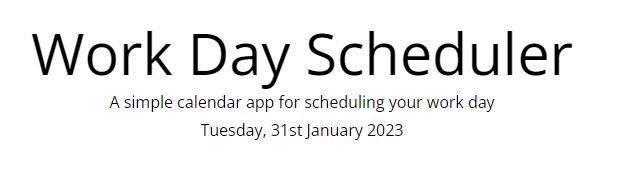
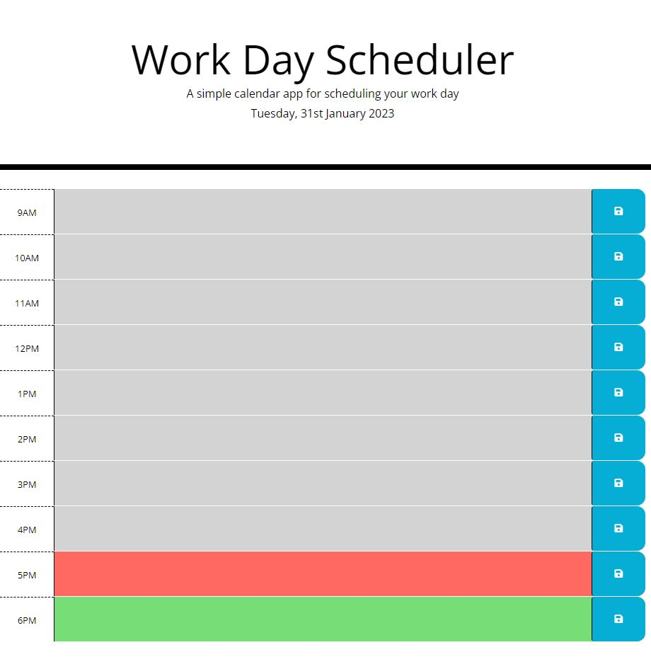
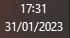
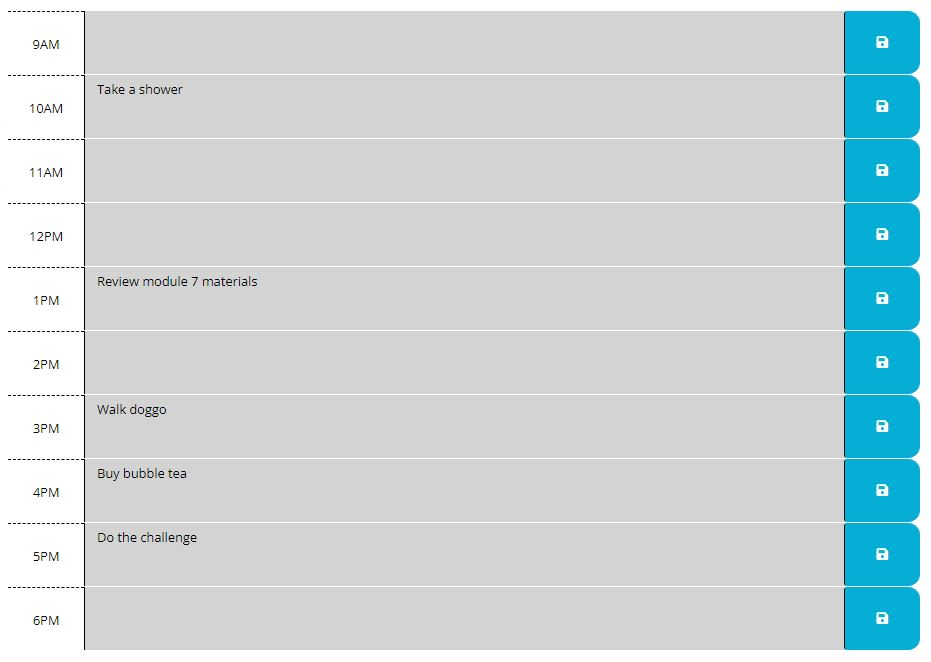
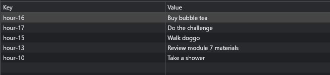

# Module 07 Challenge: Work Day Scheduler

  

</br>

## Table of Contents
* [Description](#description)
* [Features](#features)
* [Installation & Deployment](#installation-and-deployment)
* [How to Use](#how-to-use)
* [License](#license)

</br>


## Description

This challenge presents a real-world situation in which the newfound JavaScript skills will come in handy. A simple daily planner application has been built using [Moment.js](https://momentjs.com/) library to allow users to add important events for standard business hours effectively during a busy schedule. In this application, users can add events and save them for each hour. The events will be stored in a local storage and shown with indicator colors for each hour depends on the current time. Grey, Red and Green indicate past, current and up-coming/future events perspectively. The application can be run in the browser and feature dynamically updated HTML and CSS powered by jQuery.

</br>


</br>

## Features

This application works by writing down the event users wish to remember and clicking the save icon to save it. The save icon can be found next to the text box where the users write the events. The events will be saved into a local-storage. The application also makes it easier for the users to see events by seeing the color indicator based on the time.

</br>

### Current Day
Once the application is running, users can see the current day on the page. This can be found at the top of the calendar in a format as following `Tuesday, 31st January 2023`.

script.js:
  ```javascript
$("#currentDay").text(moment().format("dddd, Do MMMM YYYY"))
  ```

</br>

Application view:


</br>

### Timeblocks' color-code

To make it easier for users to find the events they are looking for or the current time they wish to add a new event, this application has been equipped with color-codes that indicate the timeblocks based on when the application is viewed. Grey, Red and Green indicate past, current, and future time perspectively. 

</br>

script.js
  ```javascript
    function hourUpdate() {
        let currentHour = moment().hours();

        for(let i=0; i<$(".time-block").length; i++) {
            let hour = parseInt($(".time-block")[i].getAttribute("id").split("-")[1])

            if(hour < currentHour) {
                $(".time-block")[i].classList.add("past")
            } else if (hour == currentHour) {
                $(".time-block")[i].classList.remove("past")
                $(".time-block")[i].classList.add("present")
            } else {
                $(".time-block")[i].classList.remove("past")
                $(".time-block")[i].classList.remove("present")
                $(".time-block")[i].classList.add("future")
            }
        }
    }
  ```

</br>

style.css
  ```css
.past {
  background-color: #d3d3d3;
  color: white;
}

.present {
  background-color: #ff6961;
  color: white;
}

.future {
  background-color: #77dd77;
  color: white;
}
  ```

</br>

Application view:


</br>

Time the application is viewed :


</br>

### Local Storage

After writing down the events, users can save them by clicking the save icon next to the text box. These data (events and time) will be saved in the local storage and will be displayed by calling the data.

  ```javascript
    $("#hour-9 .description").val(localStorage.getItem("hour-9"))
    $("#hour-10 .description").val(localStorage.getItem("hour-10"))
    ...
  ```

</br>

Application view of schedule:


</br>

Local storage view:


</br>

</br>

## Installation and Deployment

Installation not required, since this is a "plug and play" type of application. The user can simply run it locally by clicking on the `index.html` file and opening in either their default or preferred browser.

Application can also be accessed at following links:
* [GitHub repository](https://github.com/YueHuaHua/module-07-challenge).
* [Deployed application](https://yuehuahua.github.io/module-07-challenge/).

</br>

## How to Use 

* Write the events into the box 
* Click save icon next to the text box
* Your schedule is saved!

Note: Grey = past time, Red = current time, Green = up-coming

</br>

## License

Licensed under the [MIT license](https://github.com/git/git-scm.com/blob/main/MIT-LICENSE.txt). See LICENSE for the full details.
